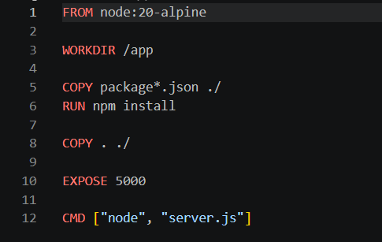
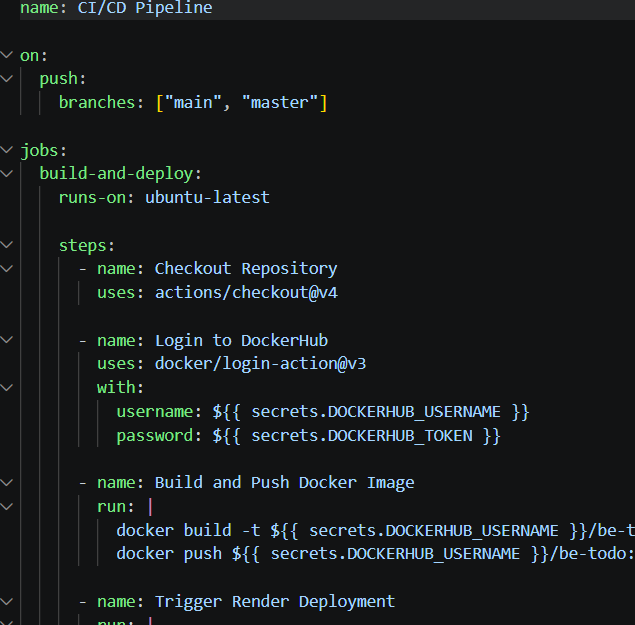
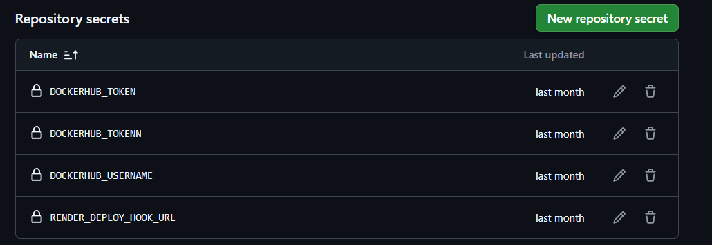
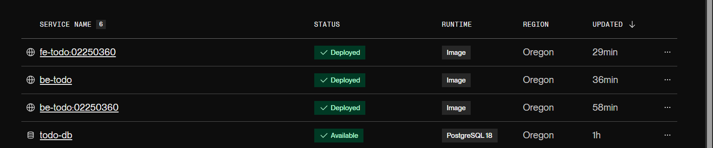
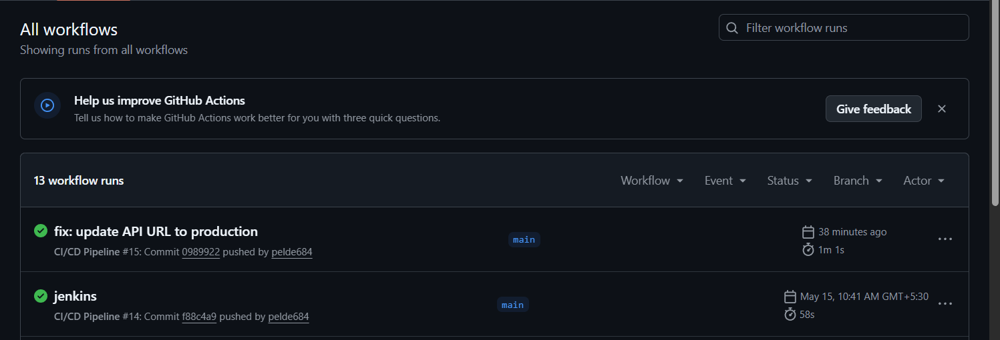

# DSO101 Assignment 3 - GitHub Actions CI/CD Pipeline
# Student: Pelden Nidup | ID: 02250360
Live URLs

Frontend: https://fe-todo-02250360.onrender.com
Backend: https://be-todo-02250360.onrender.com

# Overview
This assignment automates the build and deployment of the Todo List application using GitHub Actions. Every push to the main branch automatically builds a Docker image, pushes it to Docker Hub, and triggers a redeployment on Render.com.

# Task 1: GitHub Repository Setup

Ensured the repository is public
Verified package.json has the required scripts: start, build, and test

# Task 2: Dockerfile Verification
Verified Dockerfiles exist for both frontend and backend:
Backend Dockerfile:

Task 3: GitHub Actions Workflow
Created .github/workflows/deploy.yml:
y

# Task 4: GitHub Secrets Configuration
Added the following secrets in GitHub → Settings → Secrets and Variables → Actions:
SecretDescriptionDOCKERHUB_USERNAMEDocker Hub 

# Task 5: Render Deployment

Created Web Service on Render using existing Docker image
Copied Deploy Hook URL from Render Settings and added as GitHub secret

# Expected Outcomes

Successful GitHub Actions Workflow

# Challenges Faced

Render Webhook: Render does not automatically redeploy when a new Docker image is pushed to Docker Hub. A deploy webhook had to be added to the GitHub Actions workflow using curl to trigger redeployment manually.
GitHub Secrets: Setting up the correct secrets in GitHub was important. Using the wrong token or username caused the Docker login step to fail.
Build Context: Specifying the correct build context path (./frontend and ./backend) in the workflow was necessary since the Dockerfiles are in subdirectories.

# Solution
This assignment built on Assignment 1 by automating the entire build and deployment pipeline using GitHub Actions. Instead of manually running docker build and docker push commands, a workflow file was created that does this automatically every time code is pushed to the main branch.
The key addition was the Render deploy webhook. Since Render does not automatically detect new images pushed to Docker Hub, a webhook URL from Render was used in the GitHub Actions workflow to trigger a redeployment after the new image is pushed.
GitHub Secrets were used to store sensitive credentials such as the Docker Hub token and Render webhook URLs, ensuring they are never hardcoded in the source code.

# Reflection
This assignment gave practical experience with CI/CD automation using GitHub Actions, which is one of the most widely used tools in modern software development. Setting up the workflow to automatically build, push, and deploy on every commit removed the need for manual steps and reduced the chance of human error.
The most valuable lesson was understanding how different services — GitHub, Docker Hub, and Render — can be connected together in a pipeline. Each service plays a specific role: GitHub hosts the code, GitHub Actions automates the build, Docker Hub stores the images, and Render runs the application.
Learning to use GitHub Secrets was also an important skill, as it reflects real-world best practices for handling credentials securely in automated pipelines.