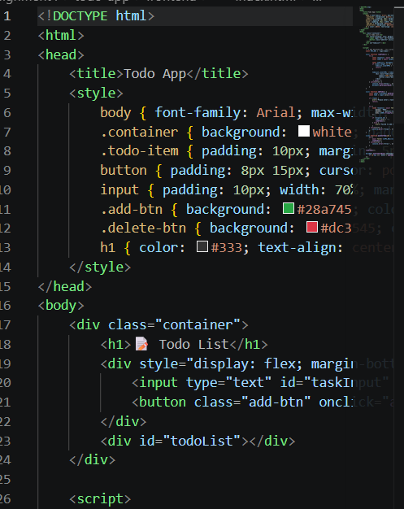
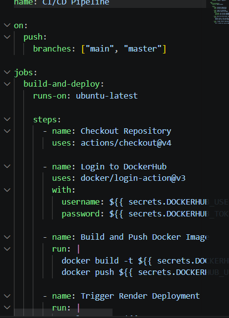

# DSO101 Assignment 4 - Deploy Web App using GitHub & Render
Student: Pelden Nidup | ID: 02250360
Module: Continuous Integration and Continuous Deployment (DSO101)
Live Deployment URL

https://dso101-cicd-assignment.onrender.com

# Overview
This assignment involved creating a simple web application, pushing it to GitHub, setting up a GitHub Actions workflow, and deploying it on Render.com.

# Step 1: GitHub Repository Setup

Created a new GitHub repository
Initialized the repository with a README
Cloned it locally and added the web application files

bash git init
git add .
git commit -m "first commit"
git branch -M main
git remote add origin <repo-url>
git push -u origin main

# Step 2: Web Application
Created a simple static HTML page:

# Step 3: GitHub Actions Workflow
Created .github/workflows/deploy.yml:

# Step 4: Deployment on Render.com

Went to Render.com and clicked New + → Static Site
Connected the GitHub repository
Left build command empty (static site)
Clicked Deploy

📸 Screenshot: Render showing "Deployed" status

# Step 5: Verify Deployment
Opened the live URL and confirmed the app is running:
📸 Screenshot: Live app showing "Hello DevOps!" at the Render URL

# Solution
This assignment demonstrated the basics of CI/CD by deploying a simple static web application using GitHub Actions and Render.com. The process involved creating a GitHub repository, adding a basic HTML page, configuring a GitHub Actions workflow that runs on every push to main, and deploying the site on Render.com as a Static Site.
The GitHub Actions workflow acts as the CI part — it checks out the code and confirms the push was successful. Render.com handles the CD part — it automatically redeploys the site whenever new code is pushed to the repository.

# Challenges Faced

Connecting GitHub to Render: Initially had to ensure the repository was public so Render could access it without additional authentication.
Understanding CI/CD Flow: Understanding how GitHub Actions triggers on a push and how Render picks up the changes helped clarify the overall CI/CD pipeline concept.

# Reflection
This assignment provided a clear and simple introduction to CI/CD concepts. Even though the workflow was basic, it demonstrated the core idea behind continuous deployment — pushing code automatically triggers a deployment without any manual steps.
Render.com made deployment very straightforward for static sites. The combination of GitHub Actions and Render.com is a practical and beginner-friendly CI/CD setup that can be scaled up for more complex applications as seen in Assignments 1 and 3.
This assignment built the foundation for understanding how more advanced pipelines with Docker, multiple services, and automated testing work in later assignments.