# KodeKloud Lab - Docker Basic Commands
Student: Pelden Nidup | ID: 02250360
Platform: KodeKloud Studio

# Overview
This hands-on lab covered essential Docker commands for container and image management. Each question required running real Docker commands in a live terminal to find answers or complete tasks.

# Lab Questions & Solutions
Q1: Check Docker Version
Command:
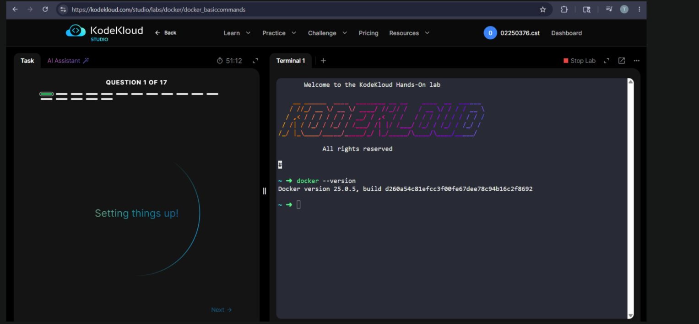

Q2: How many containers are running on this host?
Command:
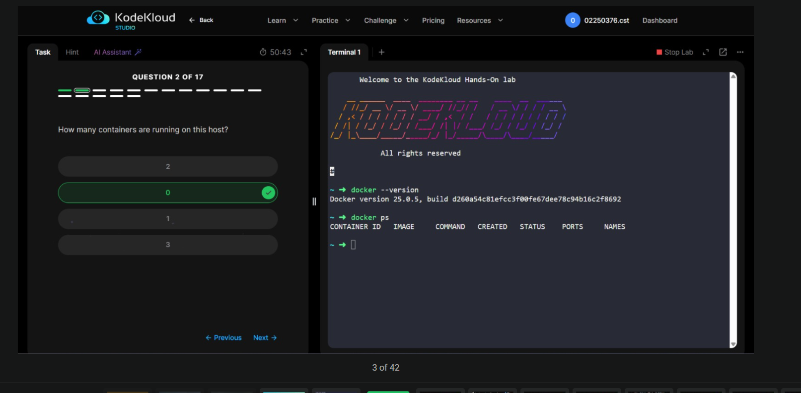

Q3: How many images are available on this host?
Command:

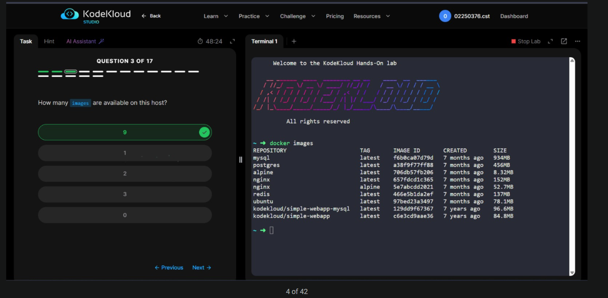

Q4: Run a container using the redis image
Command:

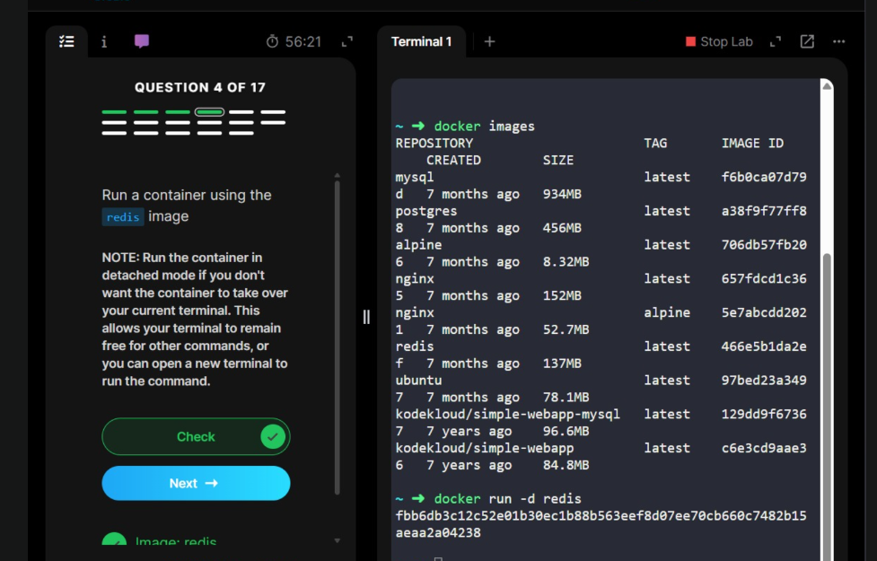

Q5: Stop the container you just created
Command:

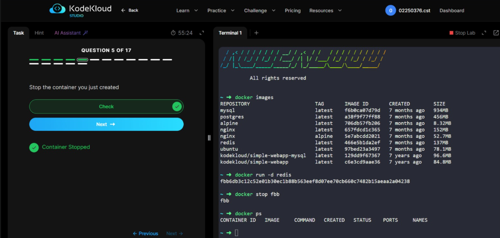

Q6: Setting things up (Lab environment reset)
The lab automatically set up new containers for the next set of questions.

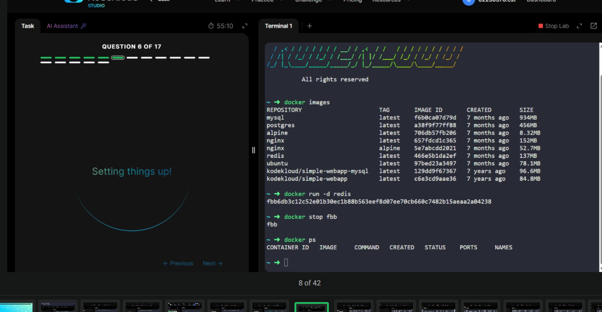

Q7: How many containers are RUNNING on this host now?
Command:

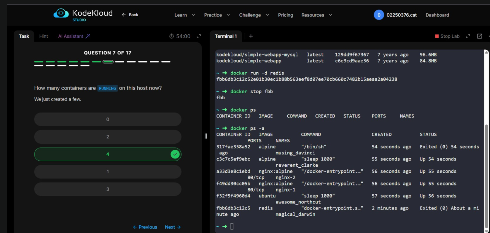

Q8: How many containers are PRESENT on the host (including stopped)?
Command:

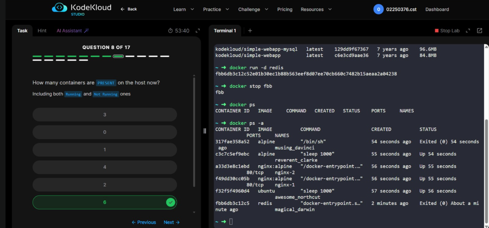

Q9: What is the image used to run the nginx-1 container?
Command:

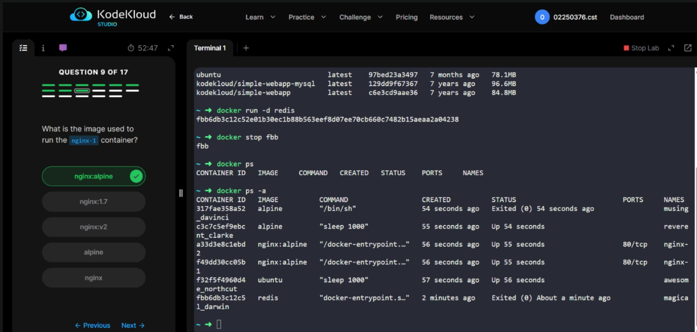

Q10: What is the name of the container created using the ubuntu image?
Command:

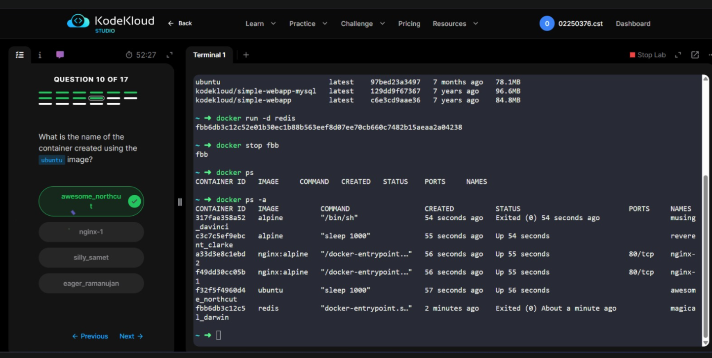

Q11: What is the full ID of the alpine container named musing_davinci?
Command:

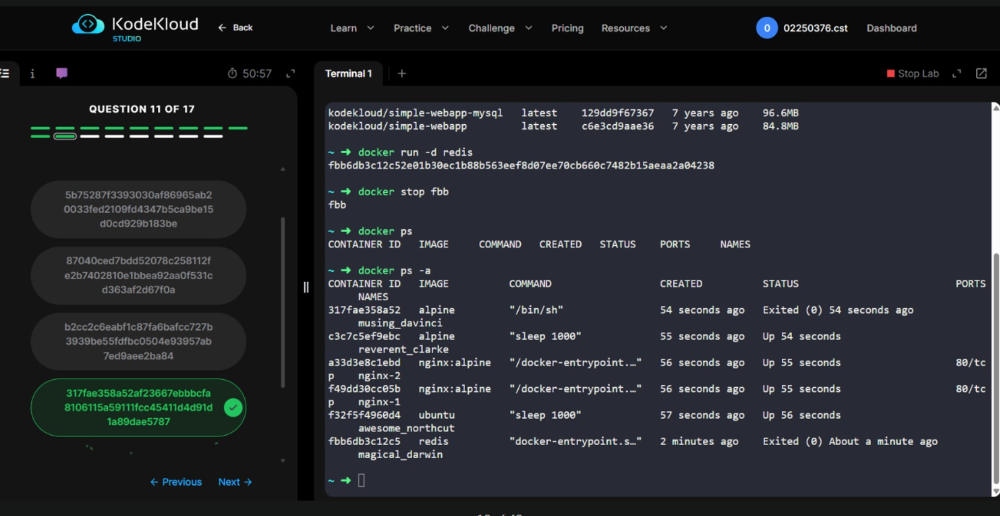

Q12: What is the state of the stopped alpine container?
Command:

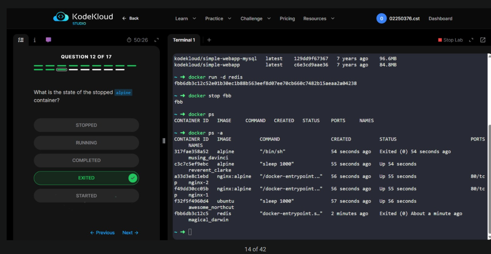

Q13: Delete all containers from the Docker Host
Challenge: Had to stop running containers first, then remove all of them.
Commands:

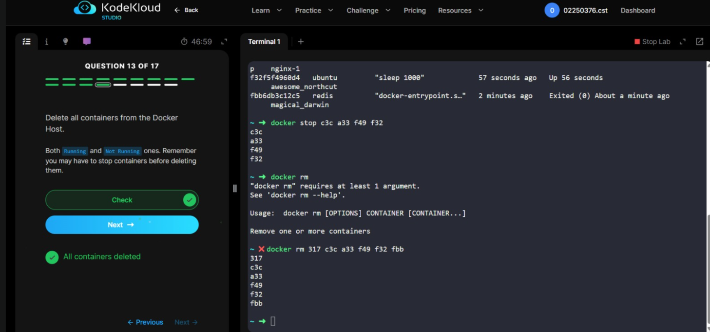

Q14: Delete the ubuntu image
Commands:

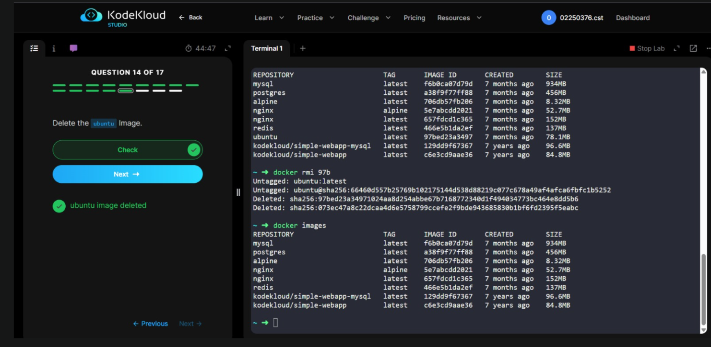

Q15: Pull the image nginx:1.14-alpine (do not create a container)
Command:

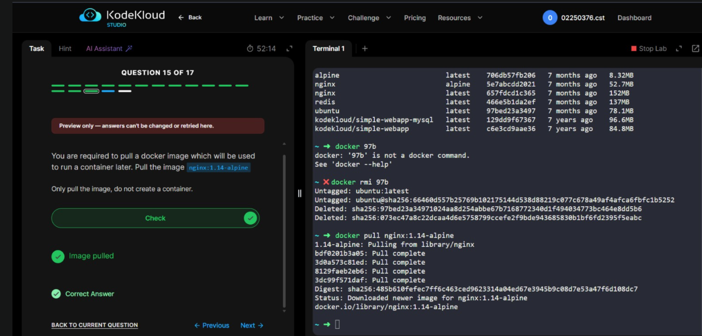

Q16: Run a container using nginx:1.14-alpine and name it webapp
Command:

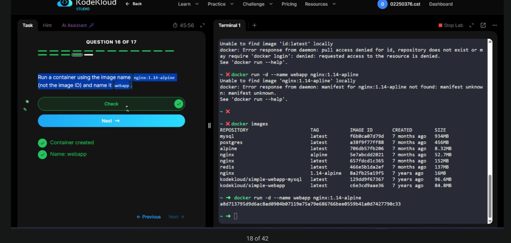

Q17: Cleanup — Delete all images on the host
Commands:

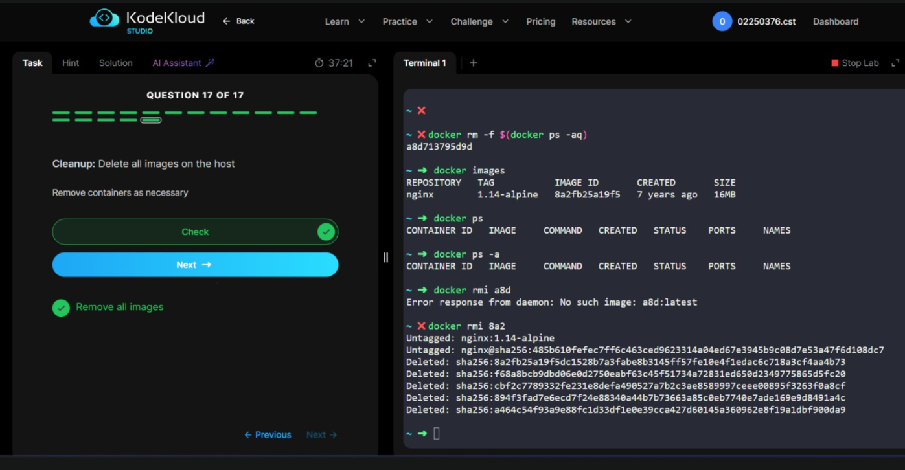

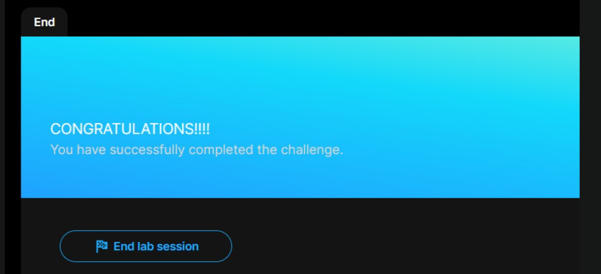

# Challenges Faced & Solutions
Challenge 1: Stopping containers before deleting (Q13)
Problem: When trying to run docker rm on running containers, the command failed because Docker doesn't allow removing running containers directly.
Solution: Had to first stop all running containers with docker stop c3c a33 f49 f32, then remove them all with docker rm 317 c3c a33 f49 f32 fbb. Multiple container IDs can be passed in one command.

# Challenge 2: Wrong image name caused error (Q16)
Problem: Accidentally typed nginx:1.14-apline (typo — "apline" instead of "alpine"), which caused the error:
Unable to find image 'nginx:1.14-apline' locally
manifest unknown: manifest unknown
Solution: Corrected the typo and used the exact image name nginx:1.14-alpine. This taught the importance of using exact image names and tags — even a small typo causes a failure.

# Challenge 3: Wrong docker rmi usage (Q17)
Problem: Initially tried docker rmi a8d but got the error:
Error response from daemon: No such image: a8d:latest
Docker interpreted a8d as an image name with :latest tag, not as a partial ID.
Solution: Used the correct partial image ID 8a2 which matched the nginx:1.14-alpine image and successfully deleted it.

# Challenge 4: Understanding docker ps vs docker ps -a (Q7 & Q8)
Problem: Q7 asked for RUNNING containers and Q8 asked for ALL containers (including stopped). Initially confused about which command to use.
Solution: Learned that docker ps shows only running containers while docker ps -a shows all containers regardless of state. The STATUS column shows either Up (running) or Exited (stopped).

# Key Concepts Learned

Image vs Container: An image is a blueprint; a container is a running instance
Detached mode (-d): Runs container in background, returns container ID
Container states: Running (Up) vs Stopped (Exited)
Partial IDs: Docker accepts the first 3+ characters of a container/image ID
Multiple operations: You can stop/remove multiple containers in one command
Exact image tags: Image names and tags must be spelled exactly correctly

# Reflection
This lab was highly practical and gave real experience with Docker container lifecycle management. Going through all 17 questions in sequence — from checking Docker version to cleaning up all images — gave a complete picture of how Docker is used in day-to-day operations.
The most valuable lessons came from the mistakes made during the lab. The typo in Q16 (apline instead of alpine) and the wrong image ID format in Q17 showed how precise Docker commands need to be. These small errors in a real project could cause deployment failures.
Understanding the difference between docker ps and docker ps -a was also a key insight — in production environments, there are often many stopped containers taking up disk space that need to be cleaned up regularly using docker rm.