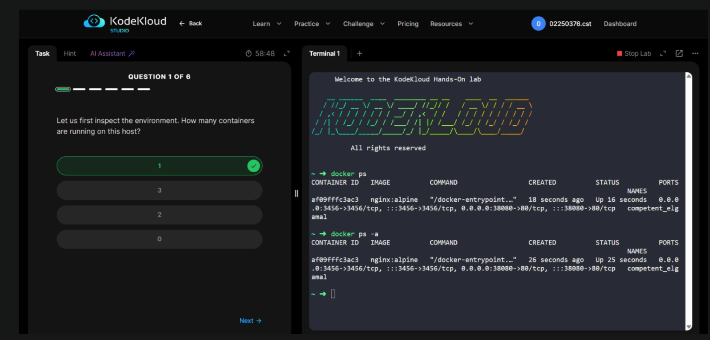
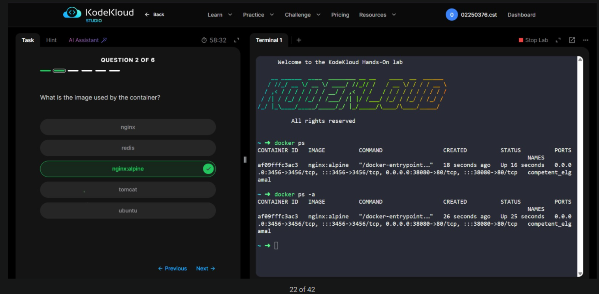
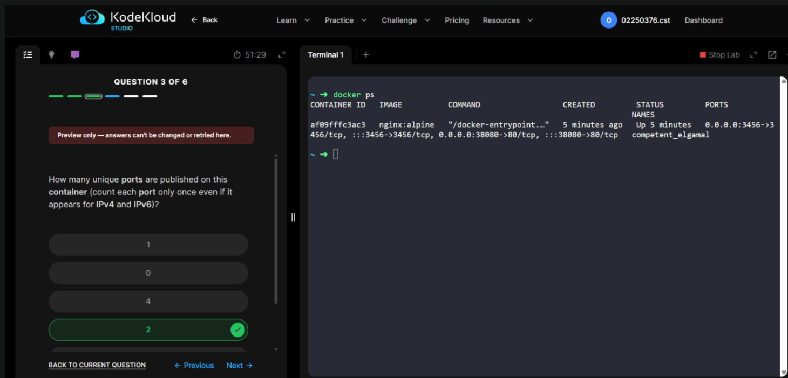
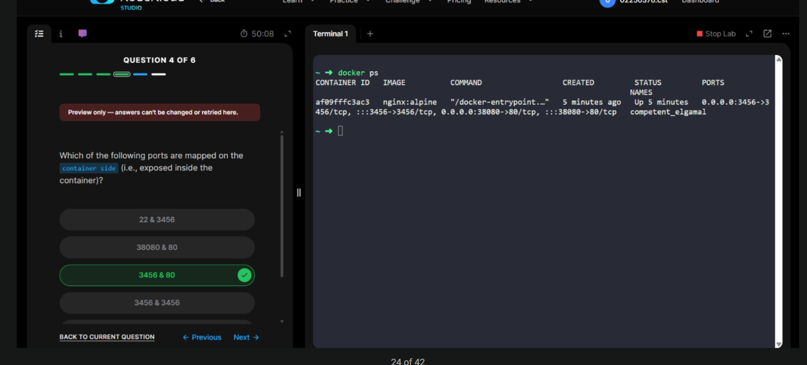
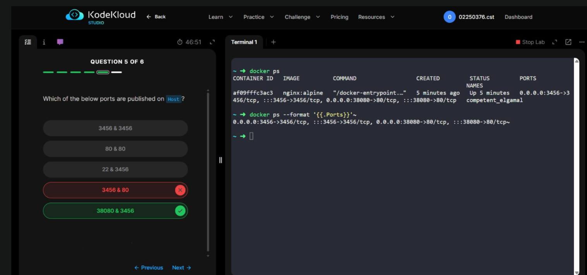
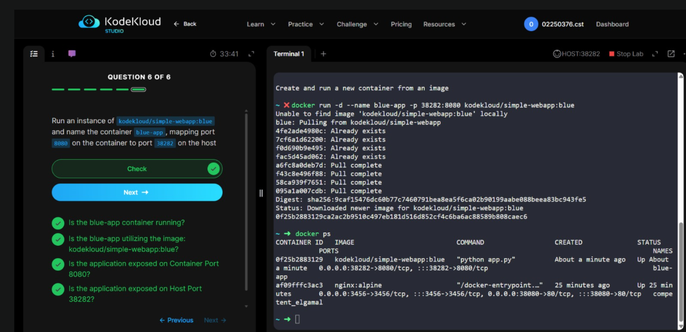
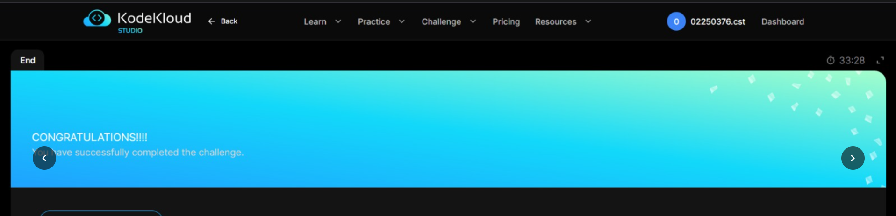

# KodeKloud Lab - Docker Run
Student: Pelden Nidup | ID: 02250360
Platform: KodeKloud Studio

# Overview
This lab focused on the docker run command and its various options including port mapping, container naming, and running containers in detached mode. It also covered how to read and interpret port mappings from docker ps output.

# Lab Questions & Solutions
Q1: How many containers are running on this host?
Command:

Q2: What is the image used by the container?
Command:

Q3: How many unique ports are published on this container?
Command:

Q4: Which ports are mapped on the container side?
Command:

Q5: Which ports are published on the Host?
Command:

Q6: Run an instance of kodekloud/simple-webapp:blue, name it blue-app, map container port 8080 to host port 38282
Command:

# Challenges Faced & Solutions
Challenge 1: Confusing host ports and container ports (Q4 & Q5)
Problem: The port mapping format HOST_PORT->CONTAINER_PORT was confusing at first. In Q5, initially selected 3456 & 80 (the container-side ports) instead of 38080 & 3456 (the host-side ports).
# Solution: 
Remembered that in Docker port mapping format, the left side of -> is always the host port and the right side is the container port. Used docker ps --format '{{.Ports}}' to get a cleaner view of the ports.

# Challenge 2: Counting unique ports when IPv4 and IPv6 both appear (Q3)
Problem: The PORTS column showed each port mapping twice — once for IPv4 (0.0.0.0) and once for IPv6 (:::). This made it look like there were 4 ports when there were actually only 2 unique ones.
Solution: Read the question carefully — it said "count each port only once even if it appears for IPv4 and IPv6". Counted only unique port numbers: 3456 and 80 = 2 unique ports.

# Challenge 3: Image not found locally (Q6)
Problem: When running docker run -d --name blue-app -p 38282:8080 kodekloud/simple-webapp:blue, Docker first said "Unable to find image locally" and then automatically pulled it from Docker Hub.
Solution: This was not actually an error — Docker automatically pulls images that are not available locally. The container started successfully after the pull completed.

# Key Concepts Learned
Port Mapping Format:
HOST_PORT->CONTAINER_PORT
0.0.0.0:38080->80/tcp

Left of -> = host port (accessible from outside)
Right of -> = container port (internal)
0.0.0.0 = accessible on all network interfaces (IPv4)
::: = accessible on all network interfaces (IPv6)

docker run flags:

-d = detached mode (background)
--name = give container a custom name
-p host:container = map host port to container port

Auto-pull: If an image is not found locally, Docker automatically pulls it from Docker Hub before starting the container.

# Reflection
This lab gave deeper understanding of Docker port mapping, which is one of the most important concepts when deploying containerized applications. Before this lab, port mappings like 0.0.0.0:38080->80/tcp looked confusing, but now the format is clear — host port on the left, container port on the right.
The biggest challenge was Q5 where the wrong answer was selected initially. This showed the importance of reading Docker output carefully, especially the direction of the -> arrow in port mappings. The docker ps --format command was also a useful discovery — it allows extracting specific fields from the docker ps output, which is helpful in scripts and automation.
The final question (Q6) brought everything together — running a container with a custom name, specific image tag, and port mapping. This is exactly the kind of command used in real deployments.