# Unit I: Containerization with Docker #

# 1.1.1 Containerization Concepts #

Containerization is a method of packaging applications along with all required files and dependencies so that they run consistently on any system. Docker containers are lightweight, fast, and isolated from each other.

# 1.1.2 Docker Architecture #

Docker architecture consists of:

Docker Client – used to run Docker commands
Docker Host – where containers run
Docker Registry – stores Docker images such as Docker Hub

1.1.3 Docker vs Virtual Machines       
Docker Containers	                                       Virtual Machines
Light                                                     weight	Heavy
Faster startup	                                          Slower startup
Share host OS kernel	                                   Have separate OS
Uses less resources	                                    Uses more resources

# 1.2 Working with Docker
# 1.2.1 Installing Docker

Docker Desktop was installed on Windows. After installation, Docker Engine was started successfully and verified using:
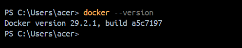

# 1.2.2 Docker CLI Basics

Some basic Docker commands used:
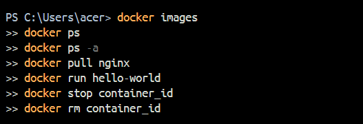
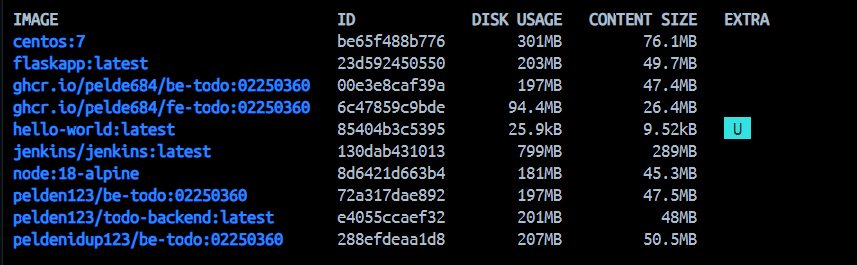
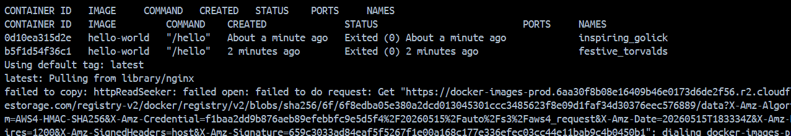
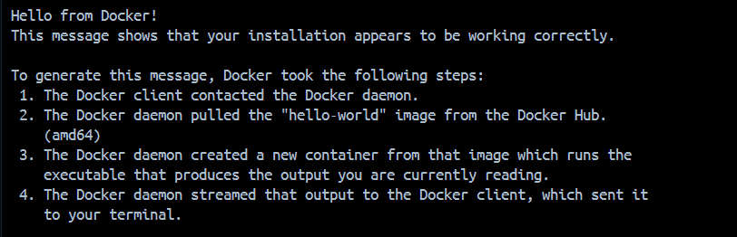

## 1.2.3 Pulling and Running Docker Images

Docker images were downloaded from Docker Hub and executed locally.

Example:

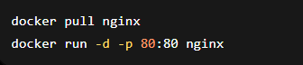

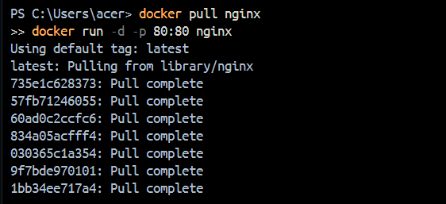

# 1.3 Building Docker Images
# 1.3.1 Dockerfile Syntax

A Dockerfile is a text file that contains instructions for building Docker images.

Example Dockerfile:

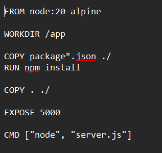

# 1.3.2 Building Custom Images

Custom images were built using:

# 1.3.3 Best Practices for Dockerfile Creation
Use lightweight base images
Reduce unnecessary layers
Use .dockerignore
Keep images small and optimized

# 1.4 Docker Networking
# 1.4.1 Docker Network Types

Docker supports different network types:

Bridge Network
Host Network
None Network

# 1.4.2 Creating and Managing Docker Networks

Commands used:

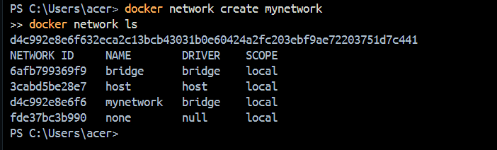

# 1.4.3 Container-to-Container Communication

Containers connected to the same network can communicate using container names.

Example:

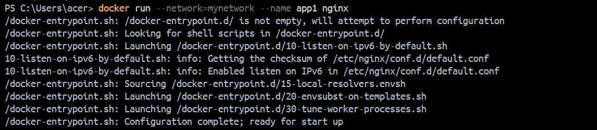

# 1.5.3 Persisting Data with Volumes

Volumes were used to store data permanently even after containers were removed.

Example:

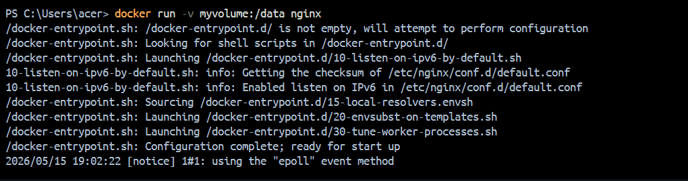

# Documentation

During this practical, Docker was successfully installed and tested. Different Docker commands, images, networks, and volumes were explored. Custom Docker images were also created using Dockerfiles.

# Reflection

This practical helped in understanding the basics of containerization and Docker. It provided hands-on experience in creating containers, managing networks, and storing persistent data using volumes. Docker made application deployment easier and more efficient.

# Clarity & Coherence

The report is organized step by step with simple explanations and command examples. All tasks were completed successfully with proper understanding of Docker concepts.