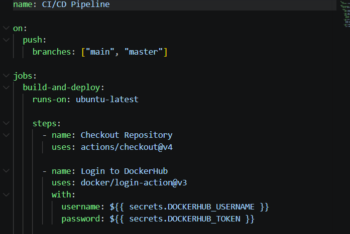
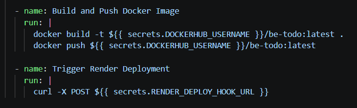
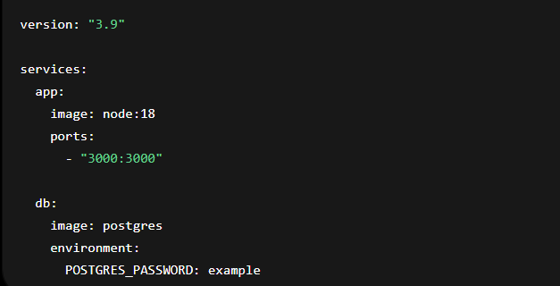
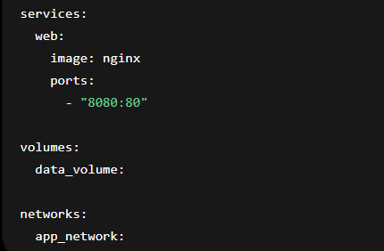
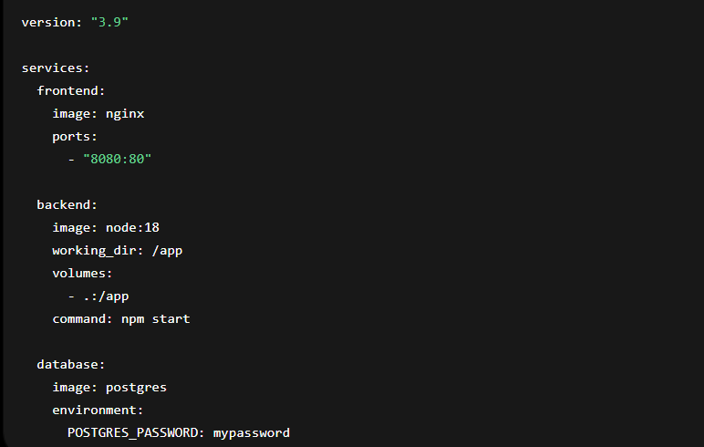
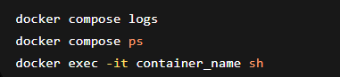
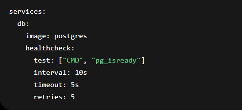

# Unit II: Docker Compose and Multi-Container Applications
# Objective

The objective of this practical was to understand Docker Compose and how it helps in managing multi-container applications using a single configuration file.

# 2.1 Introduction to Docker Compose

Docker Compose is a tool used to define and run multi-container Docker applications using a single YAML file (docker-compose.yml). It simplifies container management.

# 2.1.1 Docker Compose File Structure

A Docker Compose file is written in YAML format.

Example structure:

# 2.1.1 Docker Compose File Structure

A Docker Compose file is written in YAML format.

Example structure:

# 2.1.2 Defining Services, Networks, and Volumes
Services → containers (app, database, etc.)
Networks → communication between containers
Volumes → persistent storage

Example:

# 2.2 Managing Multi-Container Applications
2.2.1 Creating a Multi-Container Application

Example of a simple app + database setup:

# 2.2.2 Scaling Services with Docker Compose

You can scale services using:

# 2.2.3 Compose File Versions and Compatibility
Version 3.x is widely used
Supports Swarm and modern Docker features
Ensures compatibility across environments

# 2.3 Docker Compose in Development Environments
# 2.3.1 Local Development with Docker Compose

Docker Compose is used for local development to run all services together easily:

# 2.3.2 Debugging Applications in Containers

Common debugging commands:

# 2.3.3 Compose Overrides for Different Environments

You can use multiple compose files:

docker-compose.yml
docker-compose.override.yml

This helps separate development and production settings.

# 2.4 Docker Compose Best Practices
# 2.4.1 Organizing Compose Files
Keep services modular
Separate frontend, backend, and database

# 2.4.2 Environment Variables and Secrets Management

Use .env file:

POSTGRES_PASSWORD=securepassword

And in compose file:

environment:
  POSTGRES_PASSWORD: ${POSTGRES_PASSWORD}

  # 2.4.3 Health Checks and Dependency Management

Example:

# Documentation

In this practical, Docker Compose was studied for managing multiple containers efficiently. YAML configuration files were used to define services, networks, and volumes. Multi-container applications were created and tested locally.

# Reflection

This practical helped understand how Docker Compose simplifies running multiple services together. It improves development speed and makes application deployment more organized and scalable