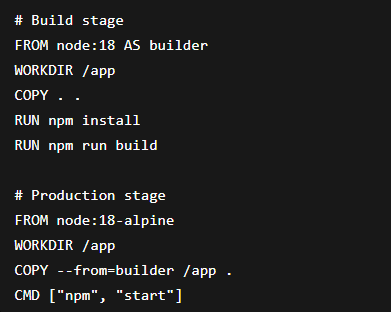
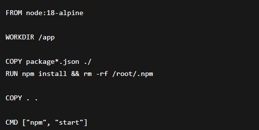

# Unit III: Docker Optimization & Registry
# Objective

The objective of this practical was to understand Docker image optimization techniques and working with Docker registries for storing and managing container images efficiently.

# 3.1 Optimizing Docker Images
# 3.1.1 Multi-Stage Builds

Multi-stage builds help reduce image size by separating build and runtime environments.

Example:

* This reduces final image size by removing unnecessary build files.

# 3.1.2 Reducing Image Size and Layers

Best practices:

Use lightweight base images like alpine
Combine commands using &&
Remove unnecessary files after installation
Use .dockerignore

Example:

# 3.1.3 Caching Strategies for Faster Builds

Docker uses layer caching to speed up builds.

Best practices:

Copy package.json before source code
Install dependencies early
Avoid changing frequently used layers

Example:

# 3.2 Working with Docker Registries
3.2.1 Docker Hub and Private Registries

Docker registries are used to store and share Docker images.

Docker Hub → public registry
Private registry → secure internal storage

3.2.2 Pushing and Pulling Images

# Documentation

In this practical, Docker image optimization techniques were explored including multi-stage builds, caching strategies, and reducing image size. Docker registries were used to store and manage images, along with tagging and versioning strategies.

# Reflection

This practical improved understanding of efficient Docker image creation and management. It showed how optimization reduces build time and image size, and how Docker Hub helps in sharing and deploying applications easily.

# Conclusion

Docker optimization techniques and registry management are important for building efficient, scalable, and production-ready containerized applications.

