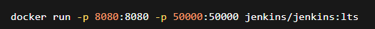
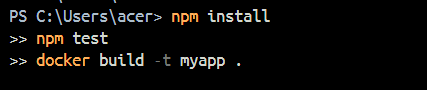
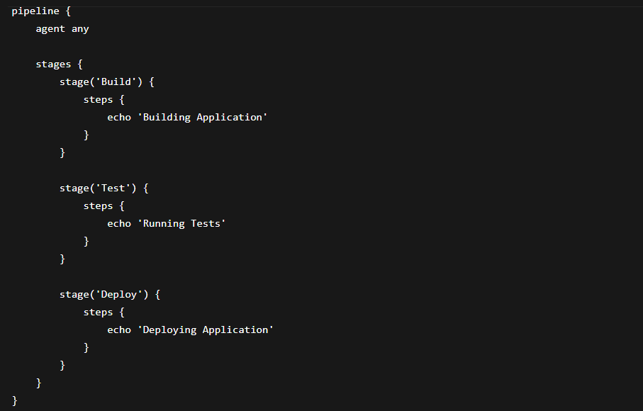

# Unit IV: Introduction to CI/CD and Jenkins
Objective

The objective of this practical was to understand CI/CD concepts and learn how Jenkins automates software building, testing, and deployment processes.

# 4.1 CI/CD Concepts and Principles
# 4.1.1 Continuous Integration Fundamentals

Continuous Integration (CI) is the process of automatically integrating code changes into a shared repository. Developers frequently push code, and automated builds and tests are performed to detect issues early.

Benefits of CI
Faster development
Early bug detection
Improved collaboration
Automated testing

# 4.1.2 Continuous Delivery vs Continuous   Deployment
Continuous Delivery	                                   Continuous Deployment
Deployment requires manual approval	                     Deployment is fully automatic
Safer for production	                                 Faster release cycle
Human verification involved	                            No manual intervention

# 4.1.3 Benefits and Challenges of CI/CD
# Benefits
Faster software delivery
Reduced manual work
Better software quality
Easier deployment process

# Challenges
Complex setup
Tool integration issues
Requires proper monitoring
Security management

# 4.2 Jenkins Architecture and Setup
# 4.2.1 Jenkins Installation and Initial Configuration

Jenkins was installed using Docker:

Access Jenkins in browser:

Initial administrator password was retrieved using:

docker exec container_id cat /var/jenkins_home/secrets/initialAdminPassword

4.2.2 Jenkins Plugins and Extensions

Jenkins supports plugins to extend functionality.

Common plugins:

Git Plugin
Docker Plugin
Pipeline Plugin
NodeJS Plugin

# Plugins were installed from:

# 4.2.3 Configuring Build Agents

Build agents help distribute builds across multiple systems.

Steps:

Open Jenkins Dashboard
Go to Manage Jenkins
Configure Nodes and Agents
Add new build agent

# 4.3 Jenkins Jobs and Builds
# 4.3.1 Creating and Managing Jenkins Jobs

Steps:

Open Jenkins Dashboard
Click New Item
Enter job name
Select Freestyle Project or Pipeline
Configure build settings

# 4.3.2 Configuring Build Triggers

Build triggers automate job execution.

Example triggers:

GitHub webhook
Poll SCM
Build periodically

Example:

# 4.3.3 Understanding Build Steps and Post-Build Actions
Build Steps

Commands executed during build process.

Example:

# Post-Build Actions

Actions executed after successful build:

Email notification
Archive artifacts
Deploy application

# 4.4 Jenkins Pipeline Basics
# 4.4.1 Introduction to Jenkins Pipeline

Jenkins Pipeline is used to automate the entire software delivery workflow using code.

# Advantages:

Automated workflow
Better version control
Easier maintenance

# 4.4.2 Jenkinsfile Syntax and Structure

Example Jenkinsfile:

# 4.4.3 Pipeline Stages and Steps
Common Pipeline Stages
Build
Test
Deploy
Pipeline Steps

Commands executed inside each stage.

Example:

# Documentation

In this practical, CI/CD concepts and Jenkins automation were studied. Jenkins was installed using Docker, plugins were configured, jobs were created, and Jenkins pipelines were implemented using Jenkinsfile.

# Reflection

This practical helped in understanding software automation and deployment workflows. Jenkins simplified the CI/CD process by automating builds, testing, and deployment tasks efficiently.

# Conclusion

CI/CD and Jenkins improve software development speed, reliability, and automation. Jenkins pipelines help manage modern DevOps workflows effectively.