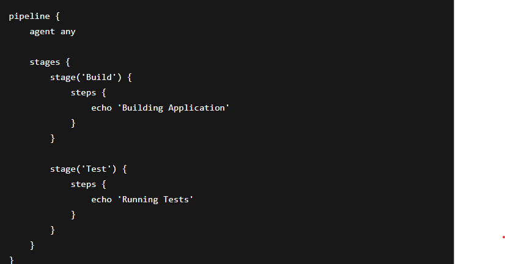
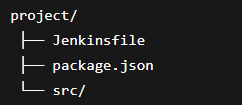

# Unit V: Advanced Jenkins Pipeline and Integration
Objective

The objective of this practical was to understand advanced Jenkins pipeline concepts, pipeline as code, external tool integration, and testing in CI/CD workflows.

# 5.1 Declarative vs Scripted Pipelines
# 5.1.1 Declarative Pipeline Syntax

Declarative Pipeline provides a simple and structured syntax for CI/CD workflows.

Example:

# Features
Easy to read
Structured syntax
Better for beginners
Built-in error handling
# 5.1.2 Scripted Pipeline and Groovy Basics

Scripted Pipeline uses Groovy scripting for advanced customization.

Example:

# Features
Flexible
Advanced scripting support
Suitable for complex workflows
# 5.1.3 Choosing Between Declarative and Scripted Pipelines
Declarative Pipeline	Scripted Pipeline
Simple syntax	Flexible syntax
Easy to maintain	More complex
Recommended for most projects	Used for advanced logic

# 5.2 Pipeline as Code
# 5.2.1 Version Controlling Jenkinsfiles

Jenkins pipelines are stored inside repositories using a Jenkinsfile.

# Benefits:

Version control
Easier collaboration
Better tracking of pipeline changes

Example repository structure:

# 5.2.2 Shared Libraries in Jenkins

Shared libraries help reuse common pipeline code across multiple projects.

Example:

# Benefits:

Reusability
Reduced duplication
Easier maintenance

# 5.2.3 Reusable Pipeline Components

Reusable stages and functions improve pipeline efficiency.

Example:

# 5.3 Integrating External Tools and Services
# 5.3.1 Source Control Integration (Git, GitHub, etc.)

Jenkins integrates with GitHub repositories for automated builds.

Example:

Webhook integration triggers builds automatically on code push.

# 5.3.2 Build Tools and Package Managers (Maven, npm, etc.)

Jenkins supports multiple build tools.

npm Example

# Maven Example

# 5.3.3 Artifact Repositories (Nexus, Artifactory)

Artifact repositories store build outputs and packages securely.

# Popular tools:

Nexus Repository
JFrog Artifactory

# Benefits:

Centralized storage
Version management
Easy deployment

# 5.4 Testing in CI/CD Pipelines
# 5.4.1 Unit Testing Integration

Unit tests verify small parts of an application.

Example:

# Benefits:

Early bug detection
Improved code quality

# 5.4.2 Integration and End-to-End Testing

Integration testing checks communication between components.

End-to-end testing verifies complete application workflow.

Example tools:

Selenium
Cypress
Postman
# 5.4.3 Test Reporting and Analysis

Jenkins can generate automated test reports.

Example:

# Benefits:

Visual test reports
Easier debugging
Performance tracking

# Documentation

In this practical, advanced Jenkins pipelines were implemented using declarative and scripted syntax. Pipeline as code concepts, shared libraries, external tool integration, and automated testing strategies were explored.

# Reflection

This practical improved understanding of advanced CI/CD workflows and automation. Jenkins pipelines made software development more organized, reusable, and efficient through automated testing and deployment.

# Conclusion

Advanced Jenkins pipelines and integrations help automate modern software delivery processes efficiently. Pipeline as code and automated testing improve software quality, scalability, and maintainability.

