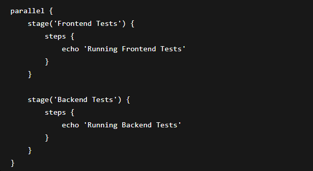
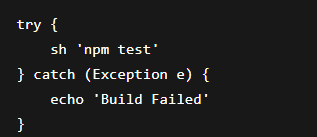
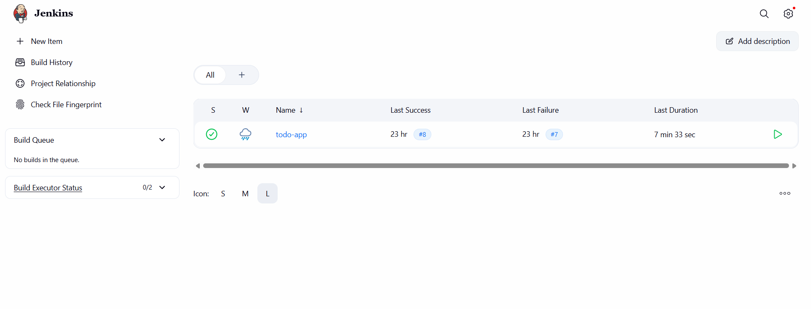
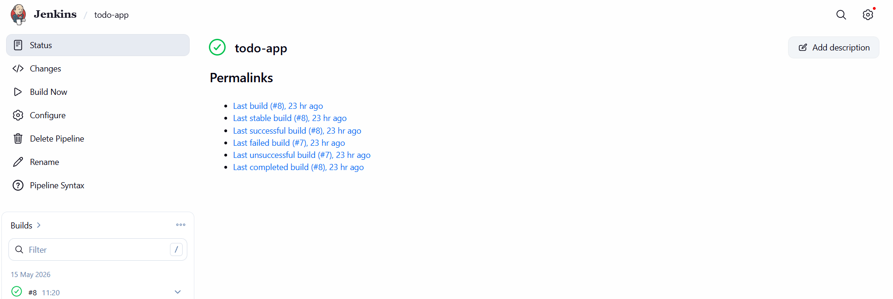

# Unit VI: Jenkins Security and Best Practices
# Objective

The objective of this practical was to understand Jenkins security, pipeline optimization techniques, monitoring methods, and best practices for maintaining reliable CI/CD workflows.

# 6.1 Jenkins Security
# 6.1.1 User Authentication and Authorization

Jenkins provides authentication and authorization features to control user access.

# Authentication

Verifies user identity using:

Username and password
LDAP
GitHub authentication
# Authorization

Controls user permissions such as:

Admin access
Read-only access
Build permissions

Example:

# 6.1.2 Credential Management in Jenkins

Jenkins securely stores credentials for:

GitHub access
Docker Hub login
API keys
SSH keys

Example:

Credentials can be used inside pipelines:

# 6.1.3 Securing Jenkins Instances

Best practices for securing Jenkins:

Enable HTTPS
Use strong passwords
Restrict admin access
Regularly update plugins
Backup Jenkins configuration
# 6.2 Pipeline Optimization
# 6.2.1 Parallelizing Pipeline Stages

Parallel execution improves pipeline speed.

Example:

# 6.2.2 Caching and Artifact Management

Caching reduces build time by reusing dependencies.

Example:

npm cache
Maven cache
Docker layer caching

Artifacts are stored for deployment and reuse.

Example:

# 6.2.3 Performance Tuning for Jenkins

Performance improvements:

Use build agents
Remove unused plugins
Increase system resources
Clean old builds regularly
# 6.3 Monitoring and Logging
# 6.3.1 Jenkins Monitoring and Alerting

Monitoring helps track Jenkins server health.

Common monitoring tools:

Prometheus
Grafana
Jenkins Monitoring Plugin

Alerts notify administrators about:

Failed builds
Server downtime
High resource usage

# 6.3.2 Log Management and Analysis

Jenkins logs help diagnose errors and monitor builds.

Example log locations:

# Benefits:

Error tracking
Troubleshooting
Performance analysis

# 6.3.3 Auditing Jenkins Activities

# Audit logs track:

User logins
Job changes
Configuration updates

# Benefits:

Security tracking
Accountability
Compliance monitoring

# 6.4 Jenkins Best Practices
# 6.4.1 Pipeline Design Patterns

Good pipeline design practices:

Keep pipelines modular
Use reusable stages
Separate build and deployment stages

Example structure:

# 6.4.2 Error Handling and Recovery

Pipelines should handle failures properly.

Example:

# Benefits:

Better reliability
Easier debugging
Automatic recovery

# 6.4.3 Documentation and Maintainability

Good documentation improves project management.

# Best practices:

Comment Jenkinsfiles
Use meaningful stage names
Maintain version control
Keep pipeline files organized
# Documentation

In this practical, Jenkins security features, optimization techniques, monitoring systems, and best practices were explored. Secure credential handling, parallel pipelines, logging, and error management were implemented successfully.

# Reflection

This practical improved understanding of maintaining secure and optimized Jenkins environments. Monitoring and best practices helped improve reliability, scalability, and maintainability of CI/CD pipelines.

# Conclusion

Jenkins security and optimization are important for reliable CI/CD systems. Proper monitoring, credential management, and pipeline design improve software delivery efficiency and system stability.

