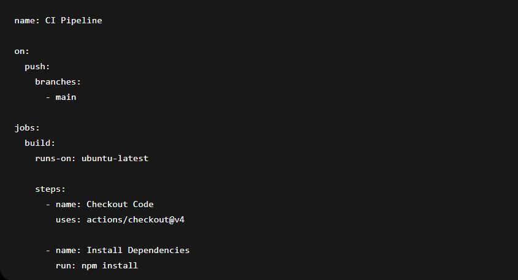
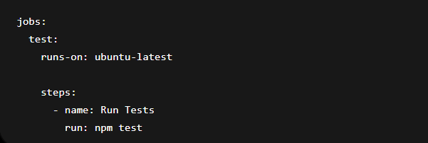
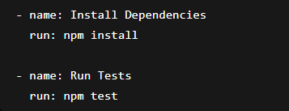
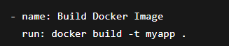
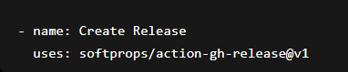
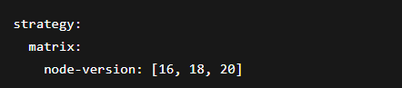
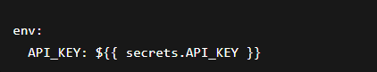

# Unit VII: GitHub Actions
# Objective

The objective of this practical was to understand GitHub Actions and implement CI/CD workflows for automating build, testing, and deployment processes directly from GitHub repositories.

# 7.1 Introduction to GitHub Actions
# 7.1.1 GitHub Actions Concepts and Components

GitHub Actions is a CI/CD automation platform integrated with GitHub repositories.

# Main Components
Workflow → Automation process
Job → Group of steps
Step → Individual task
Action → Reusable automation component
Runner → Server that executes workflows

# 7.1.2 Workflow File Structure and Syntax

GitHub Actions workflows are written in YAML format and stored inside:

Example workflow:

# 7.1.3 GitHub Actions vs Jenkins
GitHub Actions	                   Jenkins
Integrated with GitHub	      Separate CI/CD tool
Easy setup	                 Requires server setup
YAML-based workflows	     Plugin-based system
Cloud-hosted runners	     Self-managed infrastructure

# 7.2 Creating GitHub Actions Workflows
# 7.2.1 Defining Jobs and Steps

Jobs contain multiple steps executed sequentially.

Example:

# 7.2.2 Using Pre-Built Actions

GitHub Marketplace provides reusable actions.

Example:

# Benefits:

Saves development time
Simplifies workflow creation
Reusable automation
# 7.2.3 Creating Custom Actions

Custom actions automate project-specific tasks.

Example structure:

Custom actions can be written using:

JavaScript
Docker
Composite actions

# 7.3 CI/CD with GitHub Actions
# 7.3.1 Building and Testing Applications

Example workflow for building and testing:

# Benefits:

Automated testing
Faster development
Early bug detection
# 7.3.2 Deploying to Various Platforms

GitHub Actions supports deployment to:

Render
Docker Hub
AWS
Heroku
Vercel

Example Docker deployment:

# 7.3.3 Automating Releases and Versioning

GitHub Actions can automatically create releases and tags.

Example:

# Benefits:

Automated version control
Faster release management
# 7.4 Advanced GitHub Actions Configurations & Tooling
# 7.4.1 Matrix Builds and Strategy

Matrix builds run workflows across multiple environments.

Example:

# Benefits:

Multi-version testing
Better compatibility testing
# 7.4.2 Environment Secrets and Variables

Secrets securely store sensitive data.

Example:

Usage:

# 7.4.3 Caching Dependencies and Artifacts

Caching improves workflow speed by reusing dependencies.

Example:

# Benefits:

Faster builds
Reduced network usage
Improved performance
# Documentation

In this practical, GitHub Actions workflows were created for automating CI/CD processes. Jobs, steps, reusable actions, deployment pipelines, and advanced configurations such as matrix builds and caching were implemented successfully.

# Reflection

This practical improved understanding of cloud-based CI/CD automation using GitHub Actions. It simplified software development workflows and automated testing and deployment processes efficiently.

# Conclusion

GitHub Actions provides a modern and efficient CI/CD platform integrated directly with GitHub repositories. It improves automation, scalability, and software delivery speed.